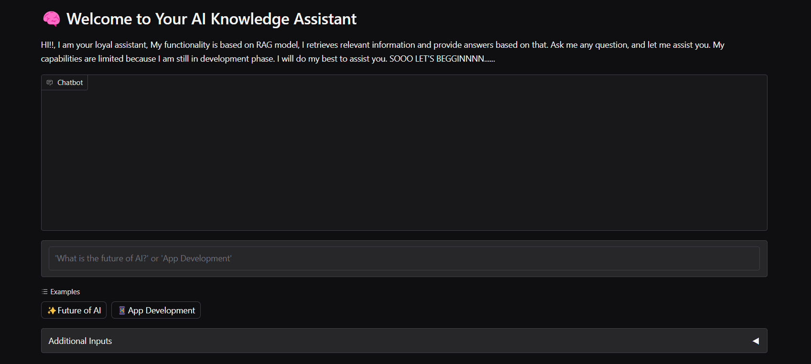
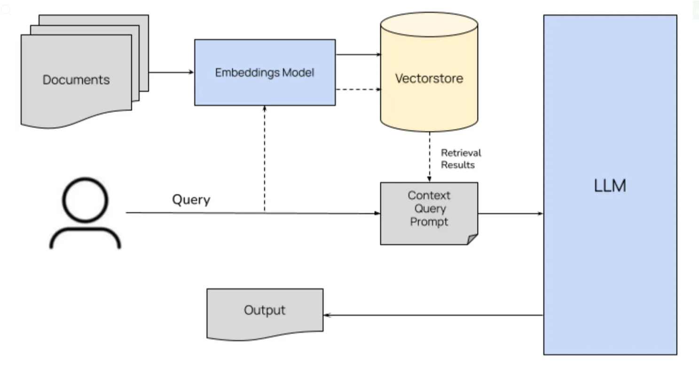
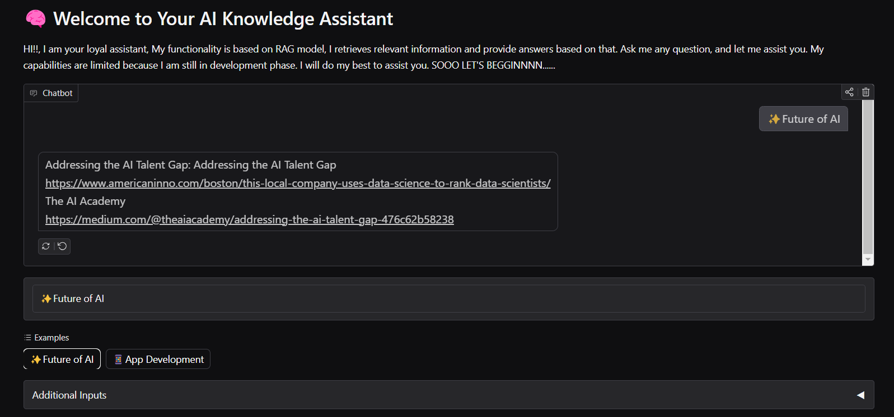
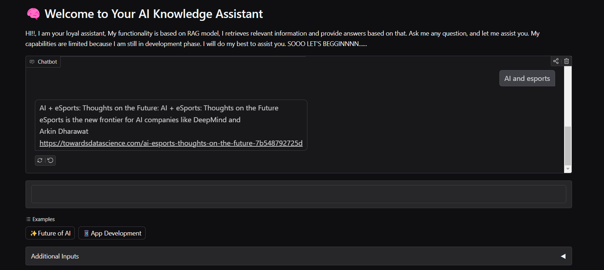
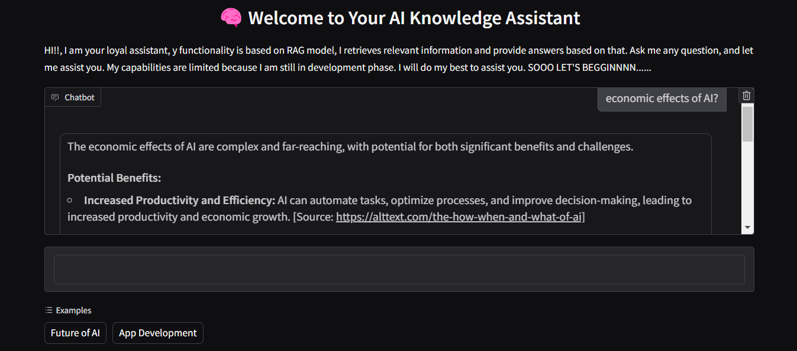
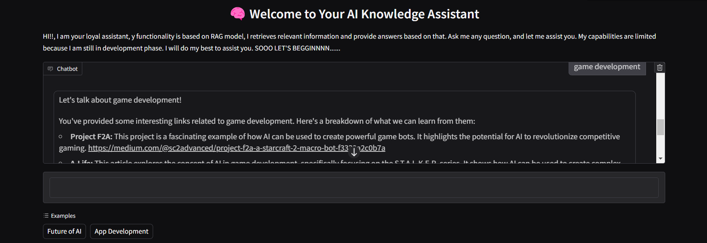

# RAG ChatBot 

RAG model on the medium blog and articles dataset. A chatbot interface to help improve bot response and information accuracy.

## Table of Content
- [Overview](#overview)
- [Dataset](#dataset)
- [Theory](#theory)
- [Indexing](#indexing)
- [Retriever and Generator](#retriever-and-generator)
  - [ChatBot with only Retriever](#chatbot-with-only-retriever)
  - [ChatBot with Retriever and Generator](#chatbot-with-retriever-and-generator)
- [Notebook](#notebook)


## Overview

The project aims to implement RAG model capabilities in the chat interface creating an AI assistant that can provide a better response to the query, inputted by the user, with precise context and higher accuracy. For this project, I have used The Medium blogs and articles dataset. This project is based on the research paper: [Retrieval-Augmented Generation for Knowledge-Intensive NLP Tasks](https://arxiv.org/pdf/2005.11401).

This project is deployed on my [Huggingface space](https://huggingface.co/spaces/Baweja/RAG) Have Fun .

Note: Currently, the capabilities of the model deployed on huggingfeace space are limited due to hardware resources. 





## Dataset
In the project, I have used a dataset of medium articles and blogs. which is available on [Kaggle](https://www.kaggle.com/datasets/harrisonjansma/medium-stories). This data was scraped from the medium's website. It is available in `.csv` format, which has more than 100 columns. For this project, I have to modify the dataset, extract relevant information and combine it into two columns: ` 'title' and 'text'`, separated by a tab `'\t'`

 * Note:- If you want to use the original code, your data **must have** two columns named  **title** and **text** and must be separated by a tab `'\t'`.

```
# To save your data in tab-separated .csv file

import pandas as pd

df = pd.read_csv('./path/to/your/file')

# modify your DataFrame as you like with 'title' and 'text' columns.


modified_df.to_csv('./path/to/your/csv', sep = '\t' )
```

## Theory 

The RAG (Retrieval Augmented Generation) model has two major components a **Retriever** and a **Generator**.  The retriever extracts information from the knowledge-base based on the query asked by a user and feeds it to the generator with the query. Then the generator uses that information from the retriever as a context to the query asked by the user to generate the relevant answer. With the help of retrieved information from the retriever, the LLM model used for generation can produce better and up-to-date results. This addresses the major drawbacks of the Hallucination and outdated information of LLMs. 





## Indexing

We have to create a knowledge-base from which the retriever can get information according to the query(input). The original paper uses the faiss (facebook AI Similarity Search ) indexing, to create its knowledge-base. In the project, I have also used the same method for my dataset. 

```
import faiss

```

You can create faiss indexing for your own dataset by using a Python file: `use_own_knowledge_datset.py` . This Python file is from the original research paper.  As I have mentioned before. if you using a dataset of `.csv` file format, ** it must be a tab-separated `.csv` file with columns "title" and "text" **. or you can modify the code according to your needs.

```
python  ./use_own_knowledge_dataset.py     --csv_path path/to/my_csv     --output_dir path/to/my_knowledge_dataset 

```

## Retriever and Generator

In the project, I have used [facebook/rag-sequence-nq](https://huggingface.co/facebook/rag-sequence-base) for the retriever, which initializes the question encoder with [facebook/dpr-question_encoder-single-nq-base](https://huggingface.co/facebook/dpr-question_encoder-single-nq-base) and for the generator, [google/gemma-2-2b-it](https://huggingface.co/google/gemma-2-2b-it) is used.

### CHatBot with only Retriever





### ChatBot with Retriever and generator






## Notebook

If you want to see step by step implementation you can access my [Google Colab notebook]()

```
................................ -- coming soon -- ....................................
```
